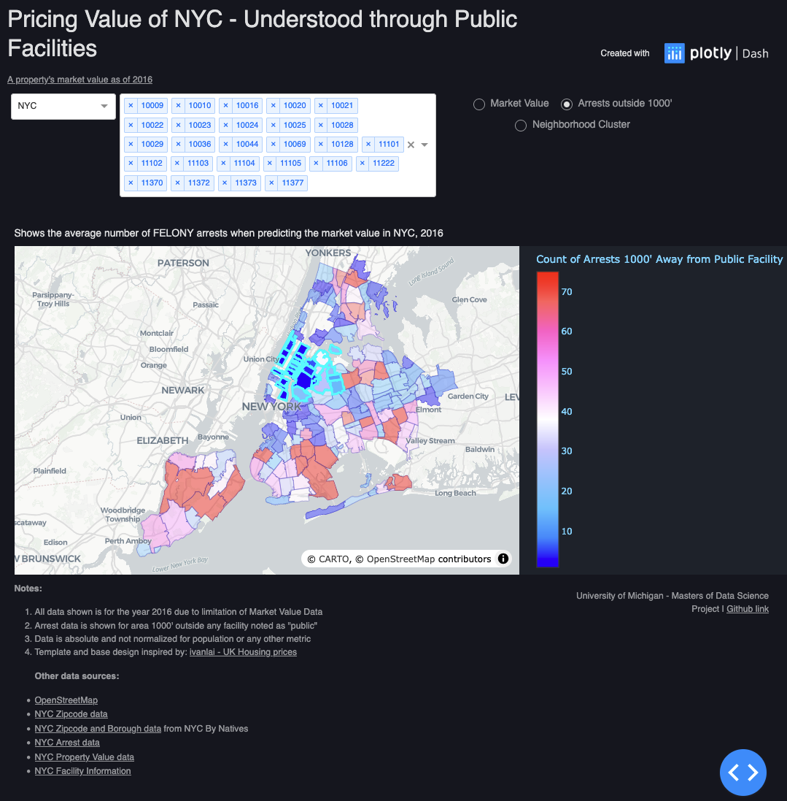
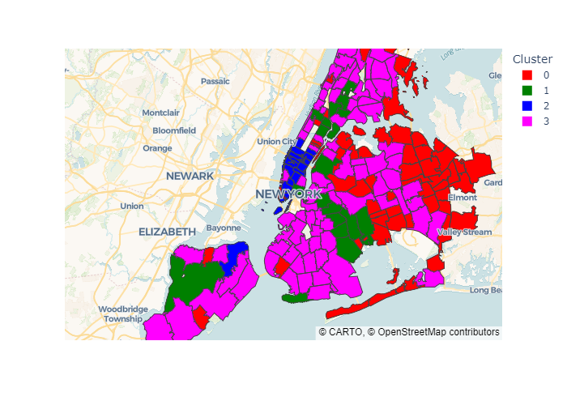
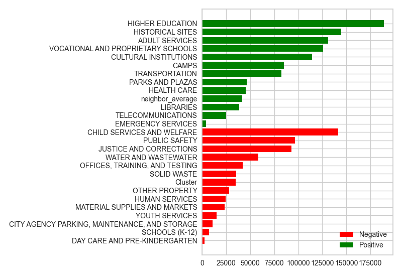

# Understanding the Impact of Public Facilities on New York City's Neighborhoods
This is a capstone project for the University of Michigan Masters of Applied Data Science by Lucas Keller, Nicolas Calo, and Tomas Castillo.

## Getting Started
Clone this repo to get started:
```
git clone https://github.com/kellerl7/Capstone.git nyc-public-facilities
cd nyc-public-facilities
```
### Prerequisites
- 🚀 Python 3.10 support
- 👾 Model development through the use of PyCaret
- 📦 Fast dependency management with uv
- 📊 Interactive visualization through Dash and Plotly

> **Project Manager**
> 
> This project utilizes the python library [uv](https://docs.astral.sh/uv/)
> It is not necessary, but is recommended

### Getting Started
The project can be run by issuing the following command:

```
pip install uv
uv run app.py
```
Within the app, there is an option to select either all of New York City, or one of the different boroughs. Additionally, you can select the different zipcodes displayed on the map. The zipcode drop down allows you to see all zipcodes associated with the selected borough.



# Project Description
The city of New York City is the largest city in the USA, and has many different resources to service residents, workers, and travelers. As such, there are many facilities to support the life-like nature of the city. This project aims to provide a glimpse into the different facilities around the city, and visualize how other factors impact the value of a given neighborhood.

First, to breakdown the distribution of different facilities, we can use k-means clustering to categorize the different ares of the city based on what facilities make up the zip code.
- Clustering is performed in the [unsupervised learning notebook](notebooks/Unsupervised.ipynb).



We used data from NYC Open Data on Revised Notice of Property Value to train our model and target the variable `revised_market_value`. By setting this is a target, we are able to better determine underlying variables' relationship, specifically public facilities, with the value of a neighborhood.

[PyCaret](https://pycaret.org/) was the library of choice to train a model, and the [Hubor Regressor from scikit-learn](https://scikit-learn.org/stable/modules/generated/sklearn.linear_model.HuberRegressor.html) was the final choice of model.
- Modeling is performed in the [supervised learning notebook](notebooks/Supervised.ipynb)

In doing so, we can visualize the most meaningful variables to the model:
.

## Project Structure
```
nyc-public-facilities/
├── data/
│   ├── model-inputs
│   ├── processed
│   └── raw
├── model
├── notebooks
├── src/
│   ├── process
│   └── viz
├── app.py
├── config.py
├── figure_utils.py
└── pyproject.toml
```

- The file `app.py` at the root directory pulls together the data and files under `src` to run a local server of Dash.
- Data from this project are open source and available for consumption at the following locations:
    - [Public facilities](https://data.cityofnewyork.us/City-Government/Facilities-Database/ji82-xba5/about_data)
    - [Zip code geospatial data](https://github.com/OpenDataDE/State-zip-code-GeoJSON)
    - [NYC Planning: Borough geospatial data](https://www.nyc.gov/content/planning/pages/resources/datasets/borough-boundaries)
    - [Market value](https://data.cityofnewyork.us/City-Government/Revised-Notice-of-Property-Value-RNOPV-/8vgb-zm6e/about_data)
    - [Crime data](https://data.cityofnewyork.us/Public-Safety/NYPD-Arrests-Data-Historic-/8h9b-rp9u/about_data)
- A majority of the data was pulled from [New York City Public Data](https://opendata.cityofnewyork.us/).
- Dash app adapated from [ivanlai/plotly-app-uk-houseprices](https://github.com/ivanlai/Plotly-App-UK-houseprices)
